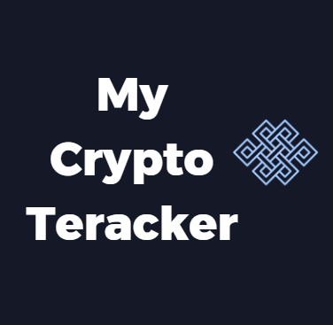

  <h2><b>CryptoCurrency Tracker (CCT)</b></h2>
   <h4><b>Readme</b></h4>

<!-- TABLE OF CONTENTS -->

  

    <h1>📗 Table of Contents</h1>
  

- [📖 About the Project](#about-project)
  - [🛠 Built With](#built-with)
    - [Tech Stack](#tech-stack)
    - [Key Features](#key-features)
  - [🚀 Live Demo](#live-demo)
- [💻 Getting Started](#getting-started)
  - [Setup](#setup)
  - [Prerequisites](#prerequisites)
  - [Install](#install)
  - [Usage](#usage)
  - [Run tests](#run-tests)
  - [Deployment](#deployment)
- [👥 Authors](#authors)
- [🔭 Future Features](#future-features)
- [🤝 Contributing](#contributing)
- [⭐️ Show your support](#support)
- [🙏 Acknowledgements](#acknowledgements)
- [❓ FAQ](#faq)
- [📝 License](#license)

# CryptoCurrency Tracker 

Welcome to MY Crypto Tracker! 
MCT Is a SPA (single-page application) where you can find information about the best cryptocurrency at the market right now. 
Our application fetches the information from this [API](https://documenter.getpostman.com/view/5734027/RzZ6Hzr3?version=latest#intro), and displays it in a well structured page, where the user can also look for a crypto in particular

## 🛠 Built With 

### Tech Stack 

    
Client

    <ul>
        <li><a href="https://es.react.dev/">React</a></li>
        <li><a href="https://redux.js.org/">Redux</a></li>
        <li><a href="https://jestjs.io/">Jest (Testing)</a></li>
    </ul>

<!-- Features -->

### Key Features 

- **[Home Page]**
- **[Details Page]**
- **[Search functionality]**

(<a href="#readme-top">back to top</a>)

<!-- LIVE DEMO -->

## 🚀 Live Demo 

[click here for Live link](https://atifcryptotracker.netlify.app/)

(<a href="#readme-top">back to top</a>)

<!-- GETTING STARTED -->

## 💻 Getting Started 

### Setup

Clone this repository to your desired folder: 

  1 - Go to the <> Code section in the repository.   
  2 - Select the https tab and copy the url provided.   
  3 - Use the git clone command in the root of the folder where you will save the project.  

### Prerequisites

In order to run this project you need:
- Visual Studio Code
- Git
- Npm
- Node
- React
- Jest

(<a href="#readme-top">back to top</a>)

### Install

Amongisde the prerequisites, you will need to install the following dependencies: 
- react-redux
- redux toolkit
- jest
- babel
- prop-types
- react-dom
- react-icons
- react-router and react-router-dom
- uuid

All of these dependencies can be installed with [npm](https://www.npmjs.com/)

(<a href="#readme-top">back to top</a>)

### Usage 

To run the project, execute the following command in your terminal (inside the project folder):

- npm init
- npm install
- npm start

(<a href="#readme-top">back to top</a>)

### Run Tests 

To run the the tests, you have to run the following command in the console (inside the project folder): 

- npm install

And then you will have to run the following command in the console (inside the project folder): 

- npm test

You will see the outcome in the console

(<a href="#readme-top">back to top</a>)

### Deployment 

To deploy this project in a local enviroment, you will have to run:

- npm start

Then, you will see the project run in a local host: 3000.
Otherwise, you can see the project deployed in Render in the live demo.

(<a href="#readme-top">back to top</a>)

<!-- AUTHORS -->

👤 **Atif Zada**
- GitHub: [@Atif-Zada](https://github.com/AtifZada)
- LinkedIn: [@Atif-Zada](https://linkedin.com/in/AtifZada)

(<a href="#readme-top">back to top</a>)

<!-- FUTURE FEATURES -->

## 🔭 Future Features 

- [ ] **[Finishing the full website]**
- [ ] **[Adding more cryptos]**
- [ ] **[Creating new pages (about, contact, etc)]**

(<a href="#readme-top">back to top</a>)

<!-- Project Presentation -->

## :movie_camera: Project Presentation 

- [Presentation]
[Click here for Live presentation](https://www.loom.com/share/307e193fb7f2468198ef0a72fc145d90)

(<a href="#readme-top">back to top</a>)

<!-- CONTRIBUTING -->

## 🤝 Contributing 

Contributions, issues, and feature requests are welcome!

Feel free to check the [issues page](https://github.com/Atifzada/React_Redux_Capstone/issues). Or send them directly to me.

(<a href="#readme-top">back to top</a>)

<!-- SUPPORT -->

## ⭐️ Show your support 

If you like this project feel free to let me know via Linkedin - Github - Twitter, also don't forget to leave your ⭐️. I will always appreciate your comments.

(<a href="#readme-top">back to top</a>)

<!-- ACKNOWLEDGEMENTS -->

## 🙏 Acknowledgments 

- Templete used in project provided [Nelson Sakwa](https://www.behance.net/sakwadesignstudio).
- API used for the data [CoinStats](https://documenter.getpostman.com/view/5734027/RzZ6Hzr3?version=latest#intro).

(<a href="#readme-top">back to top</a>)

<!-- LICENSE -->

## 📝 License 

This project is [MIT](./LICENSE) licensed.

(<a href="#readme-top">back to top</a>)

